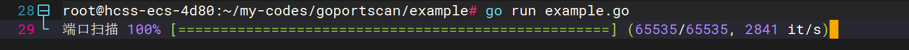
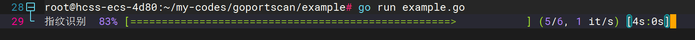
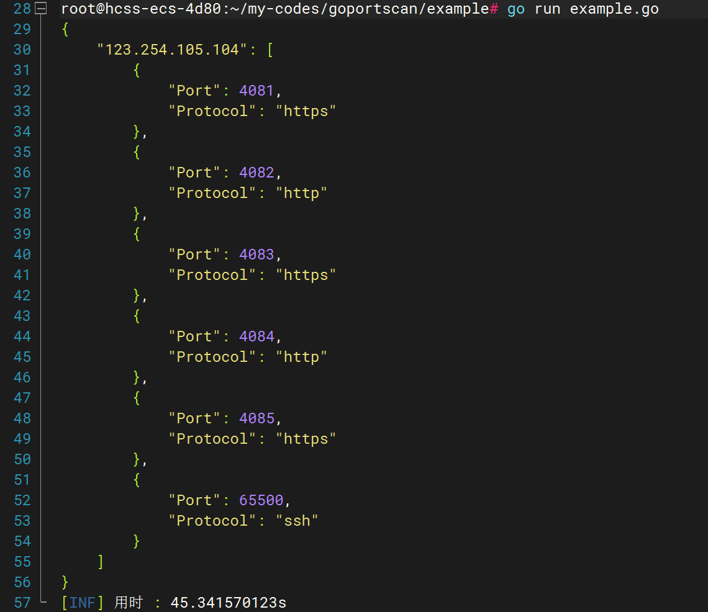

# goportscan

同 fuyoumingyan/cdncheck 该项目是构建 goauto 信息收集自动化的一环。

该项目实现的功能：

1. ICMP 检查主机存活
2. SYN 全端口扫描
3. fingerprintx 开放端口指纹识别

> PS: windows 需要安装 npcap 驱动 ~

使用：

```
go get github.com/fuyoumingyan/goportscan@v1.0.0
```

```go
func main() {
	start := time.Now()
	ips := []string{"123.254.105.104"}
	// ICMP 探测存活主机
	aliveHosts := ping.GetAliveHosts(ips, 10, false)
	// SYN 扫描全端口开放 => 具体配置自定义 ~ 45 3 10 这些配置可以再自己机器跑一下 看看具体的效果 找出比较好的 
	resultMap := scan.NewScan(aliveHosts, 45, false, 3, 10).RunEnumeration().WaitAndClose().GetResult()
	// fingerprintx 指纹识别
	results := fingerprintx.NewFingerPrint(resultMap, false).GetFingerPrints().GetResultMap()
	// 对端口号进行排序 这里只是为了输出 json 的美观
	for _, services := range results {
		sort.Slice(services, func(i, j int) bool {
			return services[i].Port < services[j].Port
		})
	}
	jsonData, _ := json.MarshalIndent(results, "", "    ")
	fmt.Println(string(jsonData))
	gologger.Info().Msgf("用时 : %v\n", time.Since(start).String())
}
```






